# Tournament_Management_System
Tournament Management system for maintaining sports in a better and easier way. Traditionally when a tournament is organized storing and processing of data with paperwork is so difficult. To remove this drawback we developed this tournament management system for maintaining sports. This project is functionalized to organize teams for adding, editing, removing and so on.  Teams' data are managed in a good manner. We designed, developed, and created a database in part by part for handling this project. Our main goal is to solve this real-life problem more functionally.

# Objectives
* Creating a tournament
* Create a new team and add to the table
* Edit the existing team from the table
* Delete existing team from table
* Display standing table
* Display teams in group
* Managing  team information

# overview
* Current tournament management system is fully based on paperwork and must manage all teams and players' records on paper.
* Paperwork is a tedious job. There can be delays and the problem of human error in managing teams and providing resources.
* Tournament Management System  can automate the process of sports.  It is useful for authorities that keep track of all the teams registered.
* Performance, Efficiency, Control, Security, etc are better than the current  system.

# Software Requirements

Operating System:	Windows 10;
Front End:			Java, Java Swing;
Back End:			MySQL;
IDE:				Netbeans;

# Hardware Requirements

Desktop PC or a Laptop;
Operating System – Windows 10;
Intel® CoreTM i3-6006U CPU @ 2.00GHz;
4.00 GB RAM;
64-bit operating system, x64-based processor;
1024 x 768 monitor resolution;
Keyboard, and Mouse;

# Architecture

# Background study
* Java
* Java awt package
* Java Swing package
* Jframe form in Netbeans
* MySQL with Workbench
* Database query
* Graphics using canvas

# Methods and packages
* Awt package
  * sub AWTEvent management methods
* Java Swing packages
  * JFrame
  * JPanel
  * Jlabel
  * Jbutton
  * JTextfield
  * Jtextarea
  * Jtable
  * JCombobox

# Results(intro)
First tab of “Tournament Management System”.  After clicking “CREATE TOURNAMENT” it opens the second tab with four buttons named “MANAGE TEAMS”, “STANDINGS”, “TEAM INFO”, and “FIXTURE”.
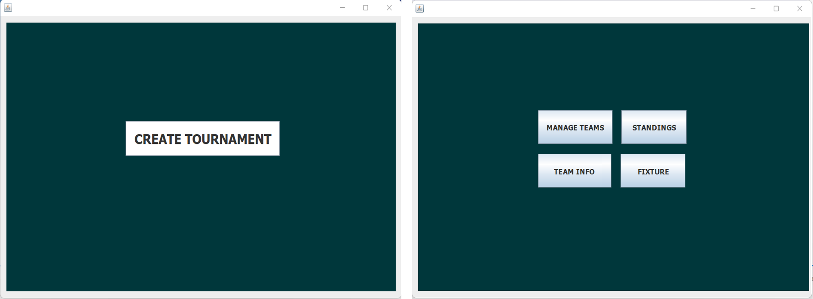.

# Results(Manage teams)
A new team can be created by clicking “ADD TEAM” button  after giving the team name in beside text field 
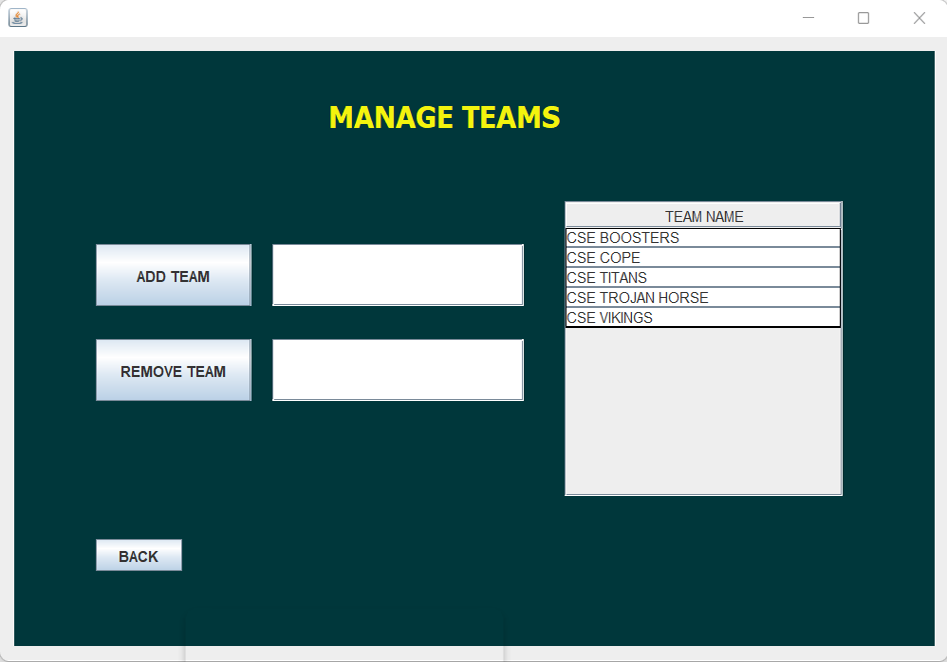.
.
The team added confirmation in the dialogue box and a new row was created for a new team in “Team name” table
.
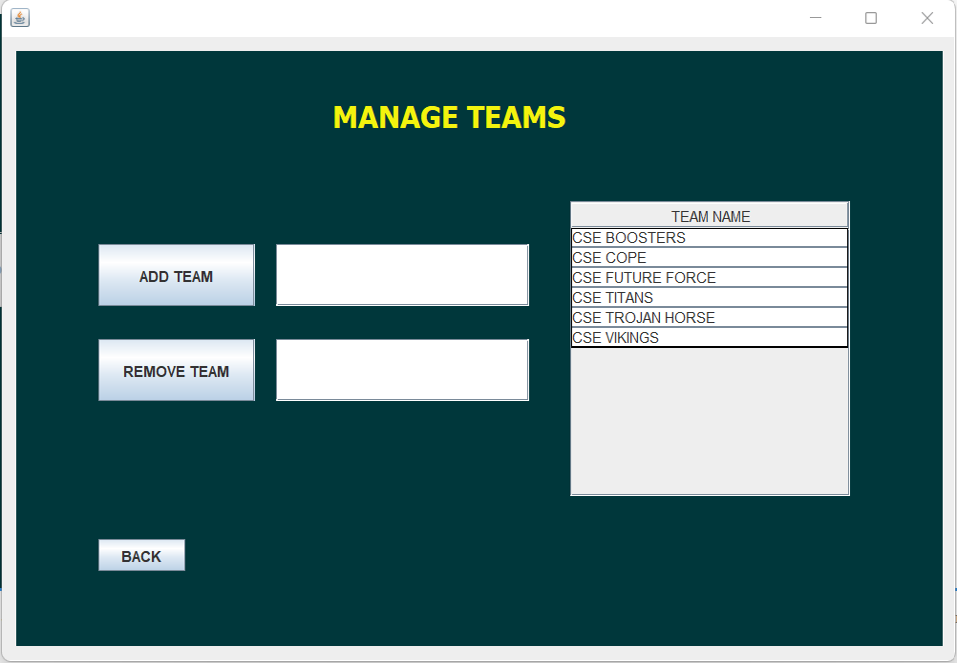.
Selecting a row of the table named “TEAM NAME” for deleting a team. By clicking the “REMOVE TEAM” button it deletes all data for that team from  the Database.
.
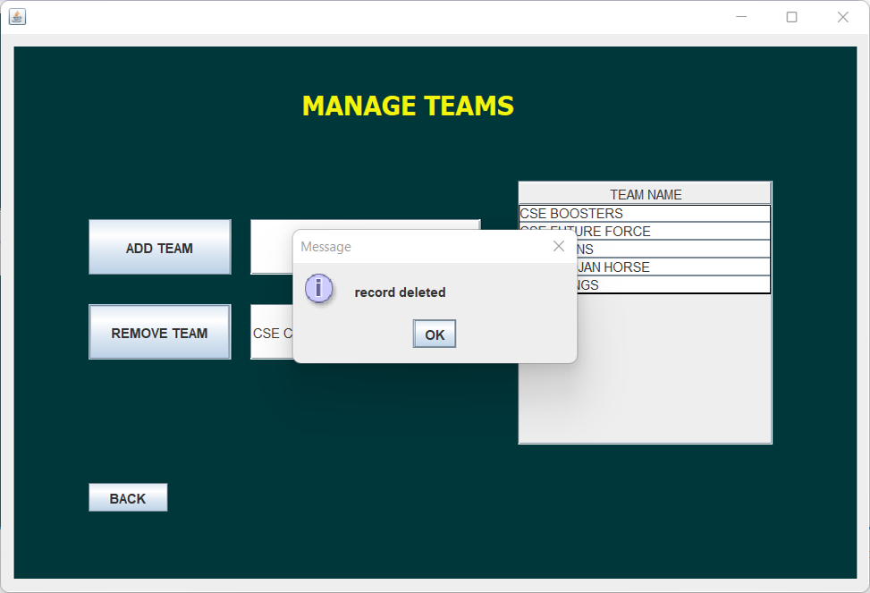.
# Results(Standings)
Selecting a row by clicking the mouse of the standing table, information is fetched in the proper text field labeled with “Team Name”, “Played Match”, “Win”.
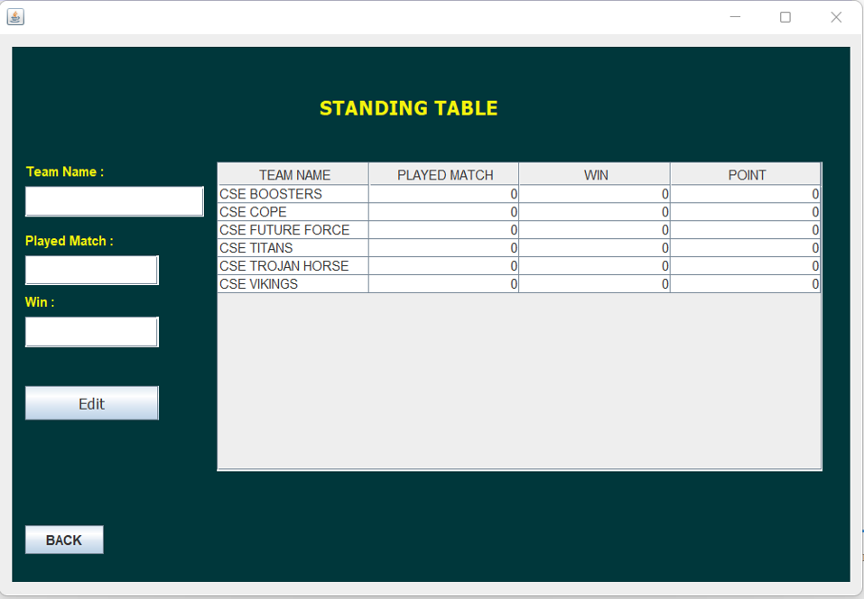.
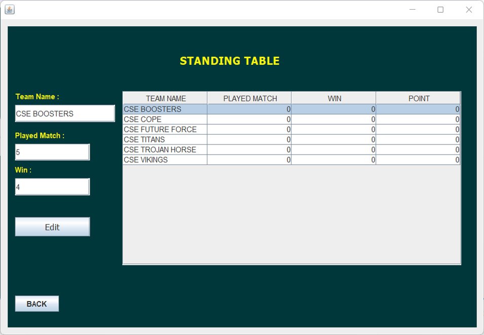.
Information in proper text fields labeled with “Team Name”, “Played Match”, and “Win” can be edited and after clicking the “Edit” button information will be saved in the Database as well as updated in the selected row of the table in application tab.
.
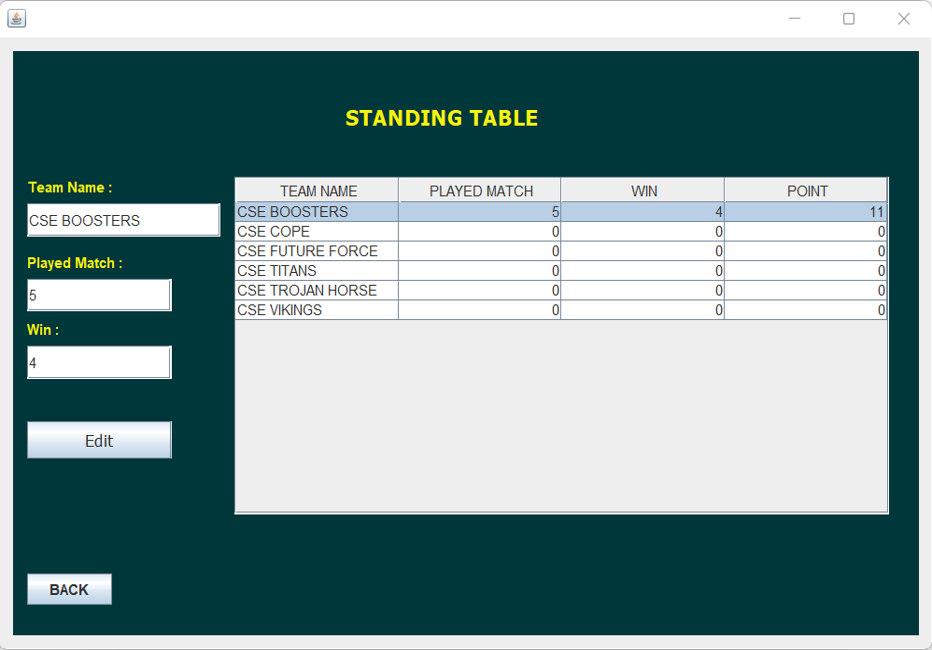.

# Results(Standings)
Players' names can be added by typing in the text area and then clicking the “Edit” button and having opportunities to show saved players' names  for a specific team choosing from Combo Box. 
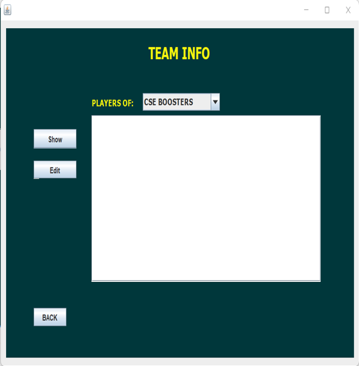.
![image]teaminfo2.png).
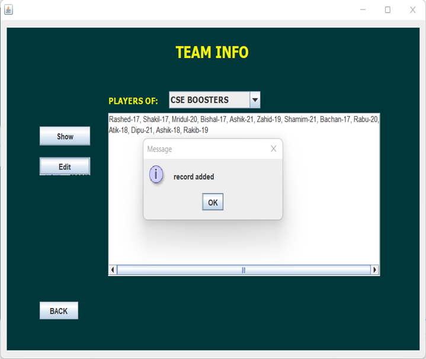.

# Results(Fixture)
Teams are sequentially added to groups named “GROUP A”, “GROUP B”, “GROUP C” and “GROUP D” when a team is created in  the “Manage Team” tab in the application.
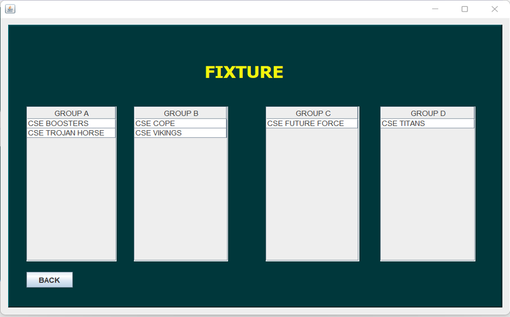.
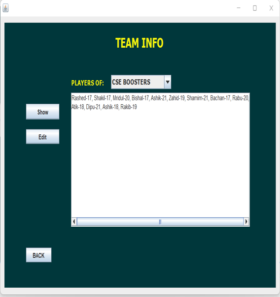.
.

# Results(Database)
Created a Schema named “ teamdata” with five columns for storing team name, played match, win, point, and player name in MySQL Workbench for storing information.
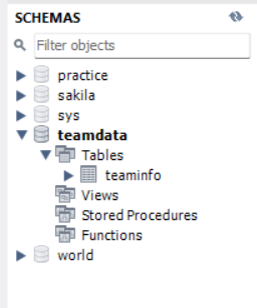.
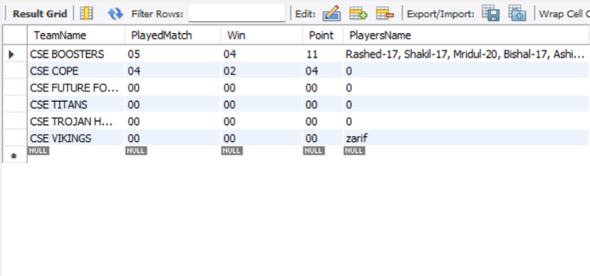.
the database is uploaded as [Database File to import](teamdata.sql)

# Conclusion
Our main motive for creating, developing, and building this project is to make the work easy for managing tournament teams. We applied various technologies and methods throughout this journey. This should be very useful and enjoyable as well. We faced so many difficulties in developing this project and our honorable mentor Hasi Saha mam helped us a lot. We learned new technologies, gained knowledge, and applied them to complete this project. We will work on this project and will make this project more functional soon.

