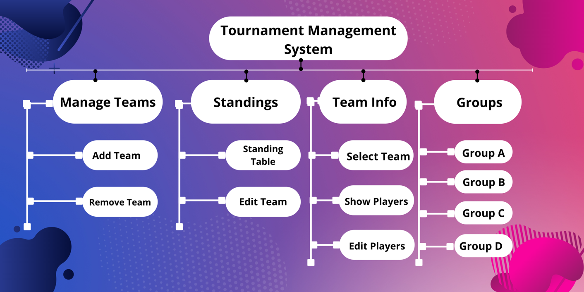

# Tournament_Management_System
Tournament Management system for maintaining sports in a better and easier way. Traditionally when a tournament is organized storing and processing of data with paperwork is so difficult. To remove this drawback we developed this tournament management system for maintaining sports. This project is functionalized to organize teams for adding, editing, removing and so on.  Teams' data are managed in a good manner. We designed, developed, and created a database in part by part for handling this project. Our main goal is to solve this real-life problem more functionally.

# Objectives
* Creating a tournament
* Create a new team and add to the table
* Edit the existing team from the table
* Delete existing team from table
* Display standing table
* Display teams in group
* Managing  team information

# overview
* Current tournament management system is fully based on paper work and must manage all teams and players' records on paper.
* Paperwork is a tedious job. There can be delays and the problem of human error in managing teams and providing resources.
* Tournament Management System  can automate the process of sports.  It is useful for authorities that keep track of all the teams registered.
* Performance, Efficiency, Control, Security, etc are better than the current  system.

# Software Requirements

Operating System:	Windows 10;
Front End:			Java, Java Swing;
Back End:			MySQL;
IDE:				Netbeans;

# Hardware Requirements

Desktop PC or a Laptop;
Operating System – Windows 10;
Intel® CoreTM i3-6006U CPU @ 2.00GHz;
4.00 GB RAM;
64-bit operating system, x64-based processor;
1024 x 768 monitor resolution;
Keyboard, and Mouse;

# Architecture

# Background study
* Java
* Java awt package
* Java Swing package
* Jframe form in Netbeans
* MySQL with Workbench
* Database query
* Graphics using canvas

# Methods and packages
* Awt package
 * sub AWTEvent management methods
* Java Swing packages
 * JFrame
 * JPanel
 * Jlabel
 * Jbutton
 * JTextfield

